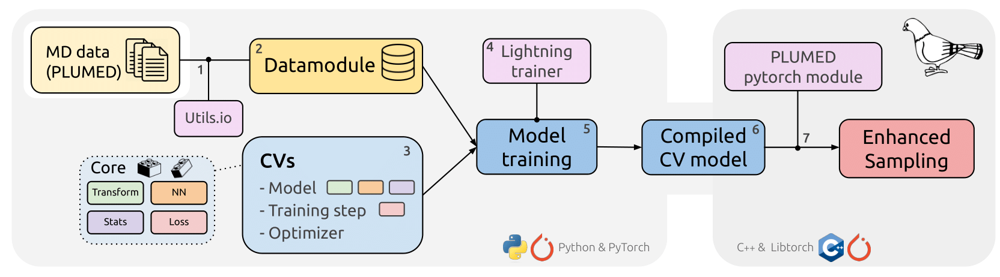

.. mlcolvar documentation master file, created by
   sphinx-quickstart on Thu Mar 15 13:55:56 2018.

   You can adapt this file completely to your liking, but it should at least
   contain the root `toctree` directive.

mlcolvar: Machine Learning Collective Variables
===============================================

.. image:: https://img.shields.io/badge/Github-mlcolvar-brightgreen
   :target: https://github.com/luigibonati/mlcolvar

.. image:: https://img.shields.io/badge/doi-10.1063/5.0156343-blue
   :target: https://doi.org/10.1063/5.0156343

.. image:: https://img.shields.io/badge/arXiv:2305.19980-red
   :target: https://arxiv.org/abs/2305.19980

``mlcolvar`` is a Python library aimed at helping design data-driven
collective variables (CVs) for enhanced-sampling simulations.

The key features are:

1. A unified framework to help test and use several CVs proposed in the
   literature.

2. A modular interface to simplify the development of new approaches and
   the combination of different methods.

3. A streamlined workflow for training and deploying descriptor-based and
   graph-based CVs in enhanced-sampling simulations.

The library is built upon the
`PyTorch <https://pytorch.org/>`_ machine-learning library and the
`Lightning <https://lightning.ai/>`_ high-level framework.

Some of the **CVs** implemented in ``mlcolvar``, organized by learning setting,
include:

* **Unsupervised:** PCA and (Variational) AutoEncoders
  [`1 <http://dx.doi.org/10.1002/jcc.25520>`_,
  `2 <http://dx.doi.org/10.1021/acs.jctc.1c00415>`_].

* **Supervised:** LDA
  [`3 <http://dx.doi.org/10.1021/acs.jpclett.8b00733>`_],
  DeepLDA
  [`4 <http://dx.doi.org/10.1021/acs.jpclett.0c00535>`_],
  and DeepTDA
  [`5 <http://dx.doi.org/10.1021/acs.jpclett.1c02317>`_].

* **Time-informed:** TICA
  [`6 <http://dx.doi.org/10.1063/1.4811489>`_],
  DeepTICA/SRVs
  [`7 <http://dx.doi.org/10.1073/pnas.2113533118>`_,
  `8 <http://dx.doi.org/10.1063/1.5092521>`_],
  and VDE
  [`9 <http://dx.doi.org/10.1103/PhysRevE.97.062412>`_].

* **Committor-based:** methods based on variational and machine-learning
  approaches to committor modeling
  [`10 <https://doi.org/10.48550/arXiv.2410.17029>`_].

Many other approaches can be implemented using the available building blocks
or through simple modifications. Check out the API documentation, tutorials,
and examples for more details.

The **workflow** for training and deploying CVs is illustrated in the figure:

The resulting CVs can be deployed for enhanced sampling with the
`PLUMED <https://www.plumed.org/>`_ package.

Descriptor-based and graph-based models can be deployed through the
PyTorch/LibTorch interfaces provided by PLUMED and ``mlcolvar``. In addition
to TorchScript deployment, graph-based CVs can also be exported using PyTorch
Ahead-of-Time (AOT) compilation.

See the :doc:`plumed` section for details.

Table of contents
-----------------

.. toctree::
   :maxdepth: 2
   :caption: Contents:

   installation
   api
   tutorials
   examples
   plumed
   contributing

Indices and tables
------------------

* :ref:`genindex`
* :ref:`modindex`
* :ref:`search`